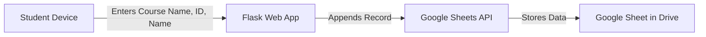

# 📚 Simple Online Attendance System

## 📝 Overview
This project is a **web-based attendance system** built with **Python (Flask)** and **Google Sheets API**.  
It allows students to submit their attendance from any device (phones, tablets, laptops) using a simple form.  
All records are instantly saved into a Google Sheet for easy tracking.

---

## 🚀 Features
- Web form accessible from any device on the network.
- Records **Course Name**, **3-digit Student ID**, **Student Name**, and **Date**.
- Data is instantly stored in a Google Sheet (cloud storage).
- Automatically creates a header row if the sheet is empty.
- Lightweight and deployable on any local or cloud server.

---

## 🛠️ Technology Stack
- **Python** (Flask framework)
- **Google Sheets API** (via `gspread`)
- **HTML Form** (rendered with Flask)
- **OAuth 2.0 Service Account** authentication

---

## 📂 Project Structure
```
attendance_system/
│
├── course_attendance_project.py   # Main Python app
├── credentials.json               # Google API credentials (not shared publicly)
└── README.md                       # Project documentation
```

---

## ⚙️ Setup Instructions

### 1️⃣ Install Dependencies
```bash
pip install flask gspread oauth2client
```

### 2️⃣ Google API Setup
1. Go to [Google Cloud Console](https://console.cloud.google.com/).
2. Create a new project or use an existing one.
3. Enable **Google Sheets API** and **Google Drive API**.
4. Create a **Service Account** and download the JSON key file.
5. Rename the key file to `credentials.json` and place it in the same folder as the project.

### 3️⃣ Create the Google Sheet
- Create a sheet named:
```
Course Attendance
```
- Share it with your **Service Account email** (found inside `credentials.json`) and give **Editor** rights.

### 4️⃣ Run the Application
```bash
python course_attendance_project.py
```

### 5️⃣ Access the Form
- The terminal will display something like:
```
Running on http://192.168.1.10:5000
```
- Share that link with your students (must be on the same network unless deployed online).

---

## 🖥️ System Flow Diagram


---

## 📊 Example Google Sheet
| Date       | Course        | Student ID | Name          |
|------------|--------------|------------|--------------|
| 2025-08-13 | Physics 101  | 123        | Alice Johnson |
| 2025-08-13 | Physics 101  | 124        | Bob Smith     |
| 2025-08-13 | Chemistry 201| 201        | Clara White   |

---

## 🔒 Security Notes
- Never commit your `credentials.json` to GitHub.
- Restrict your service account permissions to only the required APIs.
- If deploying online, use HTTPS to protect student data.

---

## 📌 Possible Enhancements
- Separate Google Sheet tabs for each course.
- Export attendance as PDF automatically.
- Deploy to Heroku, PythonAnywhere, or AWS for global access.
- Add login authentication for students.

---

